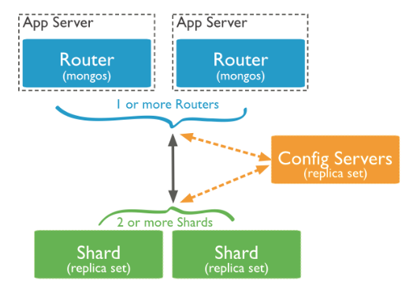

## Sharding am Beispiel MongoDB [MDB2017]

### Was ist MongoDB?
Der Begriff MongoDB bedeutet soviel wie „Humongous Database“ und dies wiederum steht für riesige oder gewaltige Datenmengen. Daraus ergibt sich auch das Einsatzgebiet von MongoDB. Diese Datenbanktechnologie ist speziell für riesige Datenmengen ausgelegt und gilt dabei als sehr performant, flexibel und skalierbar. In MongoDB werden Datensätze als Dokumente organisiert und abgespeichert. Eine Sammlung von Dokumenten werden „Kollektionen“ genannt. Dokumente unterliegen keinem festen Schema, was für eine sehr hohe Flexibilität in der Datenspeicherung sorgt. Die abgespeicherten Dokumente werden im BSON-Format (Binary JavaScript Object Notation) gespeichert. In diesem Dokumenten können dadurch nicht nur einfache Datentypen, wie Integer oder String abgelegt werden, sondern eine Speicherung von Mehrdimensionalen Arrays oder Subdokumenten ist ohne weiteres möglich. Die MongoDB NoSQL (not only SQL) Datenbank bringt von Haus aus einige Features zur Skalierung mit. So auch für das Sharding.

### Einführung
Um Kollektionen, also Sammlungen von Dokumenten, horizontal auf mehrere MongoDB-Systeme zu verteilen ist der Einsatz eines Konfigurationsservers notwendig. Vorab muss ein Shard-Key festgelegt werden. Dies kann, je nach konfiguration, ein beliebiges Datenfeld innerhalb der geshardeten Kollektion sein. Beim Sharding in MongoDB kommunizieren Clientserver mit dem Konfigurationsserver und übermitteln diesem bei Anfragen den Shard-Key des jeweiligen Datensatzes. Dieser antwortet beispielsweise mit einer Datenbankbezeichnung, welche aussagt, auf welchem Shard der betroffene Datensatz gefunden oder abgelegt werden kann.


<center></center>
<center><p style="font-size:12px" >Sharding in MongoDB [MDB2017P]</center>


### Einrichtung und praktisches Beispiel

Das Sharding in MongoDB geht anfänglich von einer einzigen Datenbank aus, auf dem das Sharding aktiviert wird und weitere Shard's, also weitere Datenbanken, hinzugeschaltet werden. Um Sharding in MongoDB einzurichten, ist es zunächst notwendig die Sharding-Mechanismen zu aktivieren. Dazu ist die Verwendung des folgenden Kommandozeilenbefehls auf der Hauptdatenbank notwendig:
```
db.runCommand({ enableSharding: "<database name>" })
```
Um nun Shard's hinzuzufügen und mit der Hauptdatenbank zu verbinden ist die Ausführung des folgenden Kommandozeilenbefehls für jeden Shard notwendig:
```
db.runCommand({ addShard: "<hostname><:port>", maxSize: <size>, name: "<shard_name>" })
```
Der Parameter maxSize ist optional und legt die maximale Speichergröße fest, die der aktuelle Shard erreichen darf. Ist diese Speichergröße erreicht, findet kein weiteres Ablegen von Datensätzen auf diesem Shard statt.

Als nächstes muss die Kollektion zum sharden vorbereitet werden. Dazu wird auf der Hauptdatenbank der folgende Befehl ausgeführt:
```
db.runCommand({
  shardCollection: "<database>.<collection>",
   key: <shardkey>,
   unique: <boolean>,
   numInitialChunks: <integer>,
   collation: { locale: "simple" }
})
```

unter dem Feld „key“ wird nun der Shard-Key aus der Kollektion angegeben. Die Verteilung der Daten wird in der Standardeinstellung automatisch erledigt. Dafür gibt es in MongoDB den sogenannten „Balancer“ (https://docs.mongodb.com/manual/reference/glossary/#term-balancer). Es ist jedoch auch möglich den Balancer selbst zu konfigurieren und somit eine eigene Verteilung anhand des Shard-Keys festzulegen, was jedoch laut der hauseigenen Dokumentation von MongoDB nicht ratsam ist.
