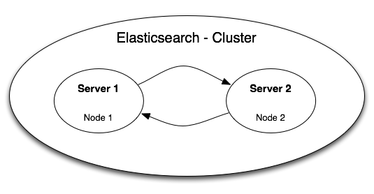
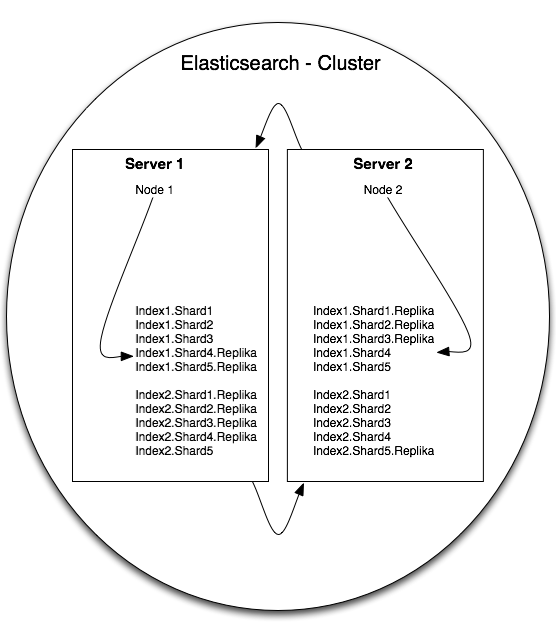

<center> <h1> Sharding</h1>
<h2>Erklären Sie unterschiedliche Sharing-Strategie anhand praktischer Beispiele </h2>
<h3>Kevin Berg </h3>
<h3>Jan Olschewski - 233673 </h3> </center>

</br>
</br>
</br>
</br>

## Inhaltsverzeichnis
- Einleitung
- Vor- und Nachteile von Sharding
- Beispiel: Mongo DB
- Beispiel: MySQL
- Beispiel: Elasticsearch
- Fazit

</br>
</br>
</br>
</br>

## Beispiel Elasticsearch

Elasticsearch ist eine ist eine Client-Server Suchmaschine, welche die Suchergebnisse in einem JSON-Format speichert und diese über RESTful-Webservice ausgibt. Daher handelt es sich bei der Datenbank, welche sich im Kern von Elasticsearch befindet um einen dokumentenbasierten Speicher. Innerhalb der Elasticsearch-Infrastruktur, dem sog. Cluster,  werden die Daten dann in Indizes gespeichert. Ein Index repräsentiert somit die Datenbank, welcher Typen enthält. Die werden von der Such-Engine wie Tabellen in einer Datenbank behandelt. In diesen Typen befinden sich dann die Dokumente mit Properties und Attributen (als Key-Value Paar)
Die RESTful API, welche Elasticsearch zu Client-Server-Kommunikation nutzt, ist ein Konzept welches Eigenschaften wie Zustandslosigkeit, Addressierbarkeit und festgelegte Operationen für entsprechende Dienste vorschreibt [ICS-2000]. Diese Dienste kommunizieren über das HTTP-Protokoll. Da jede Suchanfrage als URL formuliert wird, ist sie auch stets einzigartig und eindeutig adressierbar.

Durch die Eigenschaft von Elasticsearch als Volltext-Suchamschine mit einer NoSQL-Datenbank im Kern, ist es potentiell möglich, dass auch sehr viele Daten aufgenommen werden. Mehrere Milliarden Dokumente in einem Index führen auch zu mehreren TerraByte an benötigtem Festplattenspeicher. Dann ist es wahrscheinlich, dass die Server-Festplatte zu klein oder langsam ist, viele Suchrequests auf einem Index zu verarbeiten
Elasticsearch erstellt die Shards innerhalb des Clusters standardmäßig vollautomatisch, um die vertikale Skalierbarkeit zu gewährleisten und die Suche performant zu halten. Zusätlich wird zu jedem Shard ein Backup angelegt. Sollte ein Shard unerwartet nicht mehr lesbar oder verfügbar sein, kann auf das Replika zurückgeriffen werden.

Ein Beispiel zeigt, wie sich dieses Prinzip in der Praxis verhält:
Für die Elasticsearch-Suchengine werden zwei identische Server gemietet, welche die Suchanfragen verarbeiten sollen. Auf diesen läuft dann jeweils eine Elasticsearch-Instanz (Node). Wenn ein Server aufgrund von Stromausfall oder ähnlichen Problemen nicht erreichbar ist, kann die Suche immer noch auf der anderen Maschine erfolgen. Die Server teilen sich also normalerweise die Arbeit, wenn es aber zu Problemen eine Servers kommt, so „springt“ der andere für ihn ein, um die komplette Funktionalität weiter zu gewährleisten.

<center></center>
<center><p style="font-size:12px" >Infrastruktur eines Clusters mit zwei Server in Elasticsearch</center>

Die Daten des Index’ werden durch Elastiscsearch wie gesagt in 5 Shards mit jeweils einem Replika aufgeteilt. Das Replika jedes Shards befindet sich niemals auf der selben Node, um die ständige Verfügbarkeit zu gewährleisten. Für eine Infrastruktur mit zwei Nodes kann die Aufteilung dann folgendermaßen aussehen:

| Node   | Shard      | Shard-Replika  |
| ------ |:----------:| --------------:|
| 1      | Server 1   | Server 2       |
| 2      | Server 1   | Server 2       |
| 3      | Server 1   | Server 2       |
| 4      | Server 2   | Server 1       |
| 5      | Server 2   | Server 1       |

Besitzt das Cluster dann noch mehrere Indizes, werden diese wiederum in neue Shards aufgeteilt, welche dann völlig anders auf dem Server verteilt werden können.
Folgendes Schaubild zeigt die Verteilung von zwei Indizes innerhalb der Beispiel-Topologie:

<center></center>
<center><p style="font-size:12px" >Sharding mehrerer Indizes auf zwei Servern</center>

Dieses Besipiel verdeutlicht, wie Elasticsearch das Sharding selbständig ausführt. Doch wie gewährleistet Elasticsearch die vertikale Skalierbarkeit? Darüber soll folgendes Beispiel Aufschluss geben:

Im ersten Schritt wird ein neuer Index auf dem gestarteten Elasticsearch-Server angelegt. Dieser verfügt immer über das Standard-Setting mit 5 Shards und einem Replika pro Shard.

Das Anlegen erfolgt indem ein HTTP-POST auf den Elasticsearch-Server mit entsprechenden Document angelegt wird. Sollte es den Index noch nicht geben, wird er gleich mit erstellt.
```javascript
POST /books/book/1
{
  "title" : "Elefant",
  "author": "Martin Suter"
}
```
Nun verfügen wir über ein Dokument in dem Type „book“ (analog zum Table in SQL) auf dem Index „books“.
Der Response gibt Aufschluss darüber, dass das Document erfolgreich angelegt wurde:

```javascript
{
   "_index": "books",
   "_type": "book",
   "_id": "1",
   "_version": 1,
   "created": true
}
```

Ein HTTP-GET auf die Settings des Index' liefert nun folgenden Response:
```javascript
GET /books/_settings
{
   "books": {
      "settings": {
         "index": {
            "number_of_shards": "5",
            "number_of_replicas": "1",
            "version": {
               "created": "1030499"
            },
            "uuid": "71AAXyRPTBKhJWrTy4vp-w"
         }
      }
   }
}
```
Es ist zu erkennen, dass Elasticsearch einen Cluster mit 5 Shards angelegt hat. Um mehr oder weniger Shards zur Verfügung zu stellen muss ein neuer Index angelegt werden. Dazu wird im ersten Schritt ein PUT auf den neuen Index mit den folgenden Settings ausgeführt.
```javascript
PUT /books_less_shards/
{
    "settings" : {
        "number_of_shards" : 3,
        "number_of_replicas" : 2
    }
}
```
Der GET-Request auf die Settings des neu angelegten Index bestätigt die neue Konfiguration
```javascript
GET /books_less_shards/_settings
{
  "books_less_shards": {
     "settings": {
        "index": {
           "number_of_shards": "3",
           "number_of_replicas": "2",
           "version": {
              "created": "1030499"
           },
           "uuid": "vQT1cqNAQWS9t3Yim8Ailw"
        }
     }
  }
}
```
Nun können Documents hinzugefügt werden, die sich selbstständig auf die einzelnen Shards aufteilen. Es wurden insgesamt 4 Documents vom Type book hinzugefügt
```javascript
GET /books_less_shards/_search
{
   "took": 12,
   "timed_out": false,
   "_shards": {
      "total": 3,
      "successful": 3,
      "failed": 0
   },
   "hits": {
      "total": 4,
      "max_score": 1,
      "hits": [
         {
           ...
         }
      ]
    }
}
```
Der Response zeigt an, dass sich nun 4 Documents im Index mit 3 Shards befinden. Um die Aufteilung auf die einzelnen Shards genauer zu untersuchen stellt Elasticsearch die Funktionaliät "segments" bereit:
```javascript

{
   "_shards": {
      "total": 6,
      "successful": 3,
      "failed": 0
   },
   "indices": {
      "books_less_shards2": {
         "shards": {
            "0": [...],
            "1": [...],
            "2": [...]            
         }
      }
   }
}
```
